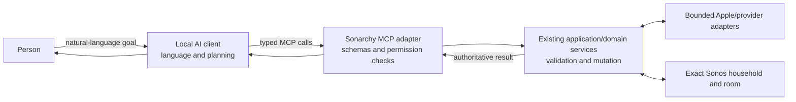
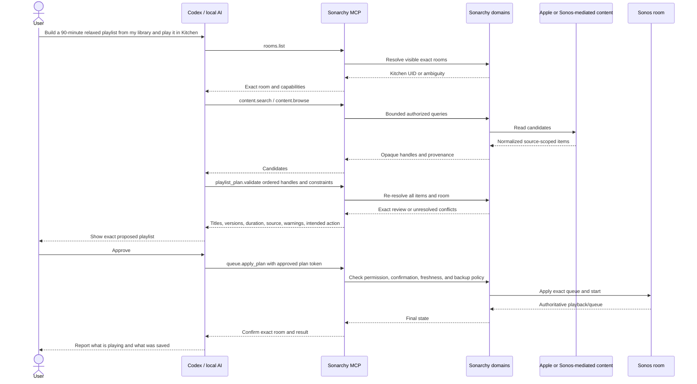

# Local AI and MCP roadmap

This document records how Sonarchy could let a local AI client such as Codex
inspect the household, prepare a bespoke playlist, and play or save it for an
explicit room through Model Context Protocol (MCP).

It describes a **planned direction**, not current functionality. The tracked
roadmap is [issue #10](https://github.com/SurreptitiousFabric/omarchy-sonarchy/issues/10)
with child issues
[#11](https://github.com/SurreptitiousFabric/omarchy-sonarchy/issues/11) through
[#15](https://github.com/SurreptitiousFabric/omarchy-sonarchy/issues/15).

## Feasibility conclusion

The overall goal is feasible in layers:

1. Sonarchy already has normalized household state, capability-driven commands,
   bounded content browsing, exact queue/playlist identity checks, and a
   persistent JSON-line application protocol.
2. A local MCP adapter can expose a carefully selected subset of those domain
   services to an AI client.
3. The AI client can interpret a natural-language request and propose an ordered
   set of tracks.
4. Sonarchy can resolve, validate, review, and execute that exact plan for a
   named room.

The uncertain part is the phrase **“using my Apple library.”** The Apple Music
account attached to Sonos lets the speaker authenticate playback; it does not
currently give Sonarchy direct access to the user's private Apple library or
personal playlists. Private-library access requires a separately proven
Sonos-mediated route or explicit Apple Music authorization.

## Current foundation

Sonarchy already provides most deterministic building blocks needed below MCP:

- one versioned request/result/snapshot protocol over private stdin/stdout;
- stable request IDs, process-local revisions, scoped errors, and authoritative
  snapshots;
- exact room, group, queue-item, playlist-item, library-path, and provider-item
  validation;
- public Apple catalogue search and validated Apple share-link playback;
- Sonos Favorites, Sonos playlists, local-library browsing, Global Player, and
  queue insertion/replacement;
- confirmation and bounded rollback for destructive operations;
- domain-separated application services rather than QML-owned speaker logic.

Relevant current sources are
[`ARCHITECTURE.md`](../ARCHITECTURE.md),
[`protocol-v1.md`](protocol-v1.md),
[`sonarchy_backend/contracts.py`](../sonarchy_backend/contracts.py), and the
[`domains/`](../sonarchy_backend/domains/) package.

## Intended responsibility split

### AI client owns

- interpreting mood, occasion, duration, inclusion/exclusion, ordering, and
  repetition constraints;
- asking clarifying questions when intent is ambiguous;
- selecting among bounded candidates and proposing a draft;
- explaining the proposed playlist to the user.

### Sonarchy owns

- exact room resolution and ambiguity rejection;
- source/account provenance;
- exact track/container identity and version resolution;
- capability, permission, value, and stale-state validation;
- deterministic duration/duplicate checks;
- confirmation policy;
- queue, playlist, playback, and restoration operations;
- safe errors and authoritative final state.

Sonarchy should not embed an opaque general-purpose LLM in its backend. The
backend remains deterministic, testable, and useful to different MCP clients.

## MCP process and transport decision

MCP currently defines standard **stdio** and **Streamable HTTP** transports. In
stdio, the client launches the server as a subprocess and exchanges MCP messages
through stdin/stdout. Streamable HTTP introduces a listening endpoint and, when
local, requires protections such as localhost-only binding, Origin validation,
and authentication.

Three designs need comparison in
[#11](https://github.com/SurreptitiousFabric/omarchy-sonarchy/issues/11):

| Option | Advantage | Main problem to solve |
|---|---|---|
| MCP stdio process creates its own Sonarchy controller | Simple client setup; no listener; lifecycle belongs to Codex | A QML backend may also be active, creating duplicate subscriptions, concurrent writes, and separate revisions/selections. |
| MCP stdio adapter reaches the existing QML-owned backend | One authoritative controller and state stream | The current pipe is deliberately private and one-client; a safe local bridge and lifecycle are required. |
| One local owner process serves thin QML and MCP adapters | Clean multi-client authority and concurrency model | Largest architecture/lifecycle change; introduces local IPC, installation, supervision, and migration work. |

**Working preference for investigation:** begin with stdio because it avoids a
network listener, but do not implement it until the concurrency and ownership
model is accepted. Stdio is a transport choice, not permission by itself.

Official references:

- [MCP transports](https://modelcontextprotocol.io/specification/2025-11-25/basic/transports)
- [MCP authorization](https://modelcontextprotocol.io/specification/2025-11-25/basic/authorization)

The MCP HTTP authorization flow does not apply unchanged to stdio. A local stdio
server still needs owner-controlled configuration, a minimal environment, and
Sonarchy-side permission enforcement. Tool annotations describe behavior; they
must not be treated as the security boundary.

## Proposed permission model

The accepted ADR may change names, but permissions should be additive and
revocable:

| Permission | Allows | Does not imply |
|---|---|---|
| `inspect` | Rooms, groups, state, capabilities, bounded queue/playlists, and authorized content search/browse | Any mutation |
| `transport` | Play, pause, stop, previous, next, and exact supported content play in an explicit room | Queue replacement, volume, settings, grouping |
| `volume` | Bounded volume/mute within owner-configured ceilings | Unbounded loudness or speaker settings |
| `queue` | Play next, append, play now, and confirmed safe replacement | Playlist deletion or arbitrary URI playback |
| `playlist-sonos` | Create/save an exact Sonos playlist | Native Apple Music playlist write |
| `playlist-apple` | Create/modify a native Apple Music library playlist through explicit Apple authorization | Access to other Apple data or credentials |

Initially denied even in write mode:

- room rename;
- grouping/ungrouping and playback handoff;
- alarms;
- speaker, Sub, surround, home-theatre, or source settings;
- TV/line-in switching;
- unrestricted volume;
- generic protocol calls, raw UPnP, shell commands, arbitrary URLs/URIs, or
  private speaker-address access.

Those actions can be designed later as separate, narrow capabilities rather
than inherited from a broad “control Sonos” grant.

## Candidate MCP surface

Names are illustrative and must be reconciled with the accepted ADR and MCP SDK
conventions.

### Read-only context

| Candidate | Purpose |
|---|---|
| `sonarchy.rooms.list` | Return visible households, exact room UIDs, labels, group membership, and targetable capabilities. |
| `sonarchy.playback.get` | Return current source, transport, item, group, volume/mute, and positive actions for one exact room. |
| `sonarchy.queue.get` | Return a bounded queue page with revision and stable item handles. |
| `sonarchy.playlists.list` | Return Sonos playlists and supported playlist kinds. |
| `sonarchy.playlist.get` | Return a bounded exact playlist page. |
| `sonarchy.favorites.list` | Return normalized Favorites with provenance and playability. |
| `sonarchy.content.search` | Search one authorized source with bounded query/result limits. |
| `sonarchy.content.browse` | Traverse an authoritative bounded container path. |
| `sonarchy.item.resolve` | Re-resolve a short-lived item handle before plan validation or execution. |

### Deterministic planning and review

| Candidate | Purpose |
|---|---|
| `sonarchy.playlist_plan.validate` | Validate exact ordered item handles, room, duplicates, durations, source claims, capabilities, and intended outcome without mutating. |
| `sonarchy.playlist_plan.preview` | Return the human-readable exact review: title, artist, album/version, source, duration, total, warnings, unresolved items, destination, and required confirmation. |

Validation must not silently choose between studio/live, clean/explicit,
original/remaster, single/album, or different artists sharing a title.

### Narrow write tools

| Candidate | Purpose |
|---|---|
| `sonarchy.playback.control` | Perform one allowed transport action for one exact room. |
| `sonarchy.content.play` | Play one previously resolved item in one exact room. |
| `sonarchy.queue.apply_plan` | Apply an approved exact plan as play-now, next, end, or safe replace. |
| `sonarchy.playlist.save_sonos` | Save an approved exact sequence as a Sonos playlist. |
| `sonarchy.playlist.create_apple` | Conditional future tool for explicitly authorized native Apple Music playlist creation. |

There must be no `sonarchy.call`, `sonarchy.play_uri`, `sonarchy.upnp`, or
“execute arbitrary operation” tool.

## Apple Music and playlist identities

The implementation must keep these objects distinct:

| Object | Current access | Where it lives | Meaning |
|---|---|---|---|
| Public Apple catalogue result | Current | Public Apple catalogue | Searchable artist/album/song metadata and validated share links; not personal library membership. |
| Apple playback through Sonos | Current | Sonos plus attached Apple Music service | Sonos authenticates playback after receiving a valid item/share link; Sonarchy does not receive the Apple credential. |
| Sonos-mediated Apple library content | Investigation | Apple service exposed through the Sonos music-service interface | May permit private browse/search with Sonos-held authentication, but Apple-specific support, stability, and write operations must be proven. |
| Private Apple Music/iCloud Music Library | Not current | User's Apple account | Requires user-specific authorization for direct Apple Music API access. |
| Sonos playlist | Current | Sonos household | A saved Sonos queue/container; not synchronized as an Apple Music library playlist. |
| Apple Music library playlist | Not current | User's Apple account | Native personal playlist; direct API creation/modification requires Apple authorization. |

### Route A: Sonos-mediated Apple service

SoCo's music-service layer can browse/search third-party services and generate
service-aware Sonos URIs, but its own documentation warns that services vary in
authentication and metadata patterns. Investigation #12 must test Apple Music
against a real household rather than assuming generic `MusicService` support is
sufficient.

Reference: [SoCo music-service API](https://docs.python-soco.com/en/v0.30.12/api/soco.music_services.music_service.html)

### Route B: direct Apple Music API / MusicKit

Apple documents access to personal iCloud Music Library content and the ability
to create or modify playlists with proper user authorization. Personalized API
requests require a developer token plus a **Music User Token**; creating a
library playlist and adding tracks are explicit API operations.

References:

- [Apple Music API overview](https://developer.apple.com/documentation/applemusicapi)
- [User authentication for MusicKit](https://developer.apple.com/documentation/applemusicapi/user-authentication-for-musickit)
- [Create a new library playlist](https://developer.apple.com/documentation/applemusicapi/create-a-new-library-playlist)
- [Add tracks to a library playlist](https://developer.apple.com/documentation/applemusicapi/add-tracks-to-a-library-playlist)

This route introduces an Apple Developer identity/private key, developer-token
rotation, browser/user authorization on Linux, Music User Token storage and
revocation, additional public HTTPS access, and marketplace/privacy review. It
must be optional and explicit. The Apple token must never be accepted from or
passed through the MCP client's own authorization token.

## Target bespoke-playlist workflow

A review token or equivalent must bind the exact ordered items, room, action,
source context, and freshness window. Editing any of those requires a new
validation/review rather than reusing approval.

## Delivery phases

### Phase 0 — architecture and authorization research

Tracked by [#11](https://github.com/SurreptitiousFabric/omarchy-sonarchy/issues/11)
and [#12](https://github.com/SurreptitiousFabric/omarchy-sonarchy/issues/12).

Outputs:

- process/transport ADR;
- threat model and permission matrix;
- QML/MCP concurrency model;
- real Apple/Sonos account feasibility evidence;
- explicit fallback when private Apple-library access is unavailable.

### Phase 1 — read-only MCP

Tracked by [#13](https://github.com/SurreptitiousFabric/omarchy-sonarchy/issues/13).

Prove exact rooms, bounded state, source provenance, safe schemas, stale-item
handling, and Codex configuration without exposing any write tool.

### Phase 2 — narrow room-targeted writes

Tracked by [#14](https://github.com/SurreptitiousFabric/omarchy-sonarchy/issues/14).

Add explicit-room transport, mute, bounded volume, and safe queue operations.
Restore all physical-speaker test state after acceptance.

### Phase 3 — bespoke playlist workflow

Tracked by [#15](https://github.com/SurreptitiousFabric/omarchy-sonarchy/issues/15).

Add exact draft validation/review and queue/Sonos-playlist outcomes. Native Apple
playlist persistence remains conditional on the result of #12.

## Security and correctness gates

Before enabling write tools:

- the MCP client cannot select a room by ambiguous display name;
- read-only configuration removes or denies every write capability;
- schemas and result sizes are bounded;
- item handles are source-scoped, short-lived or revision-bound, and
  revalidated;
- raw addresses, credentials, service metadata, DIDL, exceptions, and provider
  tokens never cross the boundary;
- prompt text and track metadata cannot invoke a hidden tool or escalate a
  permission;
- high-volume and destructive actions require owner-defined limits and review;
- a concurrent QML change produces a conflict/refresh, not a stale write to a
  different item or room;
- provider and Sonos failures return partial/recovery state honestly;
- tests cover backend restart, revocation, malformed clients, replayed approval,
  stale plans, and provider outage;
- physical acceptance verifies automatic transition from the first track to the
  second, not merely that one track started.

## Non-goals

- giving an AI unrestricted Sonos, shell, network, or UPnP access;
- treating MCP annotations as authorization;
- forwarding MCP bearer tokens to Apple or another provider;
- claiming private-library personalization from public catalogue searches;
- silently falling back from “my Apple library” to the public catalogue;
- storing Apple credentials or library data in repository fixtures/logs;
- changing grouping, alarms, room names, sources, or speaker settings as a side
  effect of a playlist request;
- running a maintainer-operated cloud recommendation or telemetry service.
