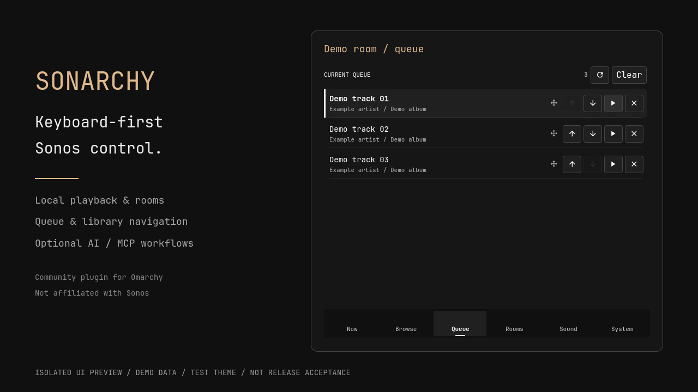

# Owner-reviewable marketplace package

Status: preparation only for #57. **Do not submit: #48/#64 remain on HOLD.**
No publication, release, repository-visibility change or owner attestation has
been made by preparing these files.

Proposed title: **[Plugin]: Sonarchy**

The [submission body](marketplace-submission.md) is a standalone copyable draft.
It preserves the six required headings and all five exact checklist statements.
All boxes are intentionally unchecked: only the owner can confirm the final
statements and authorize sending the complete title/body to the marketplace.
The proposed category is Hardware; tags are media, bar and ai. These describe
local speaker hardware control, the bar widget and optional AI-client workflows,
not a bundled model or unrestricted MCP controls.

## Verified rules and ID check

Reference marketplace revision, checked 2026-09-07:
[`b6a2c19acf1de20261b63d2281d84ca3b6239a91`](https://github.com/omacom/omarchy-plugin-marketplace/commit/b6a2c19acf1de20261b63d2281d84ca3b6239a91).
Primary sources are its
[CLI/AI submission guide](https://github.com/omacom/omarchy-plugin-marketplace/blob/b6a2c19acf1de20261b63d2281d84ca3b6239a91/SUBMISSION.md)
and [submission form](https://github.com/omacom/omarchy-plugin-marketplace/blob/b6a2c19acf1de20261b63d2281d84ca3b6239a91/.github/ISSUE_TEMPLATE/submit-plugin.yml).

The public GitHub root repository must contain one root manifest, a README with
install/removal instructions, a license and dependency documentation. The
category must match exactly and the body accepts one to three lowercase tags
from the guide; the web form's display labels differ in capitalization.

The complete 4,448,101-byte `registry.json` at that revision was read with a
5 MiB bound and inspected case-insensitively for the exact plugin ID
`io.github.surreptitiousfabric.sonarchy` and repository path
`SurreptitiousFabric/omarchy-sonarchy`. Both had zero occurrences, including
the retired-ID and repository-migration collections. This is dated absence
evidence, **not an ID reservation**. Recheck the live registry immediately before
submission; retired or renamed IDs remain unavailable. No registry changed.

Root previews are optional. Accepted names are `preview.png`, `preview.jpg`,
`preview.jpeg`, `preview.webp` or `preview.avif`; limits are 50 MB and
40 megapixels. The marketplace strips metadata and creates optimized variants.
The checked-in PNG is much smaller and carries no text/EXIF/profile payload.

New publication requires a fresh matching exact-commit baseline and an
authorized marketplace maintainer's `approved-and-verified` decision. A complete
selective review result can require exact capability/finding acceptance;
blocking findings and incomplete scans cannot be waived by this draft.
Listing is not a security audit or sandbox. See the current
[marketplace security policy](https://github.com/omacom/omarchy-plugin-marketplace/blob/main/SECURITY.md)
again before any future submission; this dated package cannot attest to future
rules, scans or commits.

## Preview and provenance



The PNG depicts actual `SonarchyQueuePage.qml` and `SonarchyNavigation.qml`
inside an original presentation frame. All room/track/artist/album labels are
invented demo strings. There is no artwork, third-party photograph, Sonos logo,
live household capture, recording identity, private configuration or account
data. The footer explicitly says isolated UI preview, demo data and test theme;
this is not installed-shell, physical-device or release acceptance evidence.

The renderer copies the existing visual-only Qt test imports into a private
temporary directory. It augments the otherwise invisible test Button with
simple demo visuals and uses the installed pure OpticalGlyph component; it
does not reproduce the installed theme's full control appearance. The production
page/navigation logic is not rewritten. A deterministic test-owned service
supplies rows; any mutation call fails the render. No backend, shell, Style/Color
live singleton, network image or speaker discovery is instantiated.

The presentation fixture and PNG are project assets under the root MIT license.
The two rendered Sonarchy components are existing MIT source. Typography uses
the installed `ttf-jetbrains-mono-nerd-basic 3.4.0-1` JetBrains Mono font. Its
installed license credits the JetBrains Mono Project Authors and grants use
under SIL Open Font License 1.1; that license distinguishes output documents
from redistribution of the font itself. No font binary is bundled here.
See the [JetBrains Mono source/license](https://github.com/JetBrains/JetBrainsMono)
and the installed package license when reproducing. These recorded inputs do
not substitute for the owner's final rights/permission confirmation.

Recorded artifact: 1280 × 720 PNG, 63,928 bytes; SHA-256:

```text
0b48a41bb23d6f0f0440a1b78fcf9eba31c2c67e7af4eb7f16e1244aa8e0fec3
```

Source/host references for this asset:

```text
SonarchyQueuePage.qml       3b2e500acc62b1e5ffefb5043ca8356ef475eb195b3852942b5ed32dc88d798c
SonarchyNavigation.qml      e1c9d43bbba40fca2332ec1e74dc3fb5d3b08ddee6619b4ad7fe9eec331aa4ed
installed OpticalGlyph.qml  15aa7d9d7b5d574e915e6d23216df581c5e6f7a54f3ca86027f56ba873244b78
installed font             0ec29a68b539ece7078fc714cebff0c0accb2f4948f8f7963d9f5e86633b12d9
installed font OFL.txt      30f0c136e3c88e422d0791acd97238870f9054a9729bc34cf2ff0d4ed8cac4ad
```

Both production components are unchanged from merged main
`5d2cab57e7ff1264d399f5704c28fa8455eeebef`. Rendering used Qt 6.11.2, offscreen
software rendering and private HOME/runtime directories. Reproduction needs
the recorded Omarchy visual component and font; do not install them or change
the desktop automatically. Render to a new explicit path:

```bash
mise exec -- python -m scripts.render_marketplace_preview /absolute/new/path/preview.png
```

The output's parent must already exist. Existing files are refused. Review a
new render visually, validate its provenance and only then explicitly replace
the root asset and update its recorded digest. Different Qt/font revisions can
change pixels; byte-for-byte cross-platform reproduction is not promised.
Generic CI validates the checked-in raster/template, not a live Omarchy render.

## Owner handoff

The owner must review this draft and preview, confirm every original checklist
statement, and select the exact passing release candidate. Repeat registry,
current-template and baseline checks against that candidate; complete the
applicable installed/device gates in `ACCEPTANCE_TESTS.md`. Only after explicit
approval may the five draft checkboxes be checked and the final title/body
submitted. No automated publishing command is included in this package.
