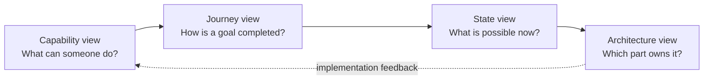
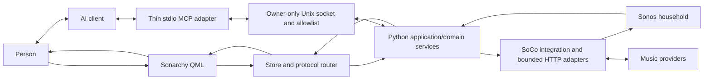

# Sonarchy system model

This directory explains Sonarchy from the outside in. It is intended for a
maintainer, reviewer, or AI coding agent that needs to understand the product
before reading individual QML and Python modules.

## The four views

The views deliberately overlap, but they are not interchangeable:

1. [Capabilities](capabilities.md) groups the current user-facing product and
   its explicit boundaries.
2. [Journeys](journeys.md) shows important end-to-end paths using BPMN-oriented
   tasks, decisions, lanes, validation, and recovery.
3. [State models](state-models.md) shows legal transitions and why an action can
   be available in one context and unavailable in another.
4. [`ARCHITECTURE.md`](../../ARCHITECTURE.md) maps the behavior to QML,
   protocol, application/domain services, adapters, and Sonos.

The current narrow AI surface is documented in [MCP setup](../mcp.md) and
[AI-curated Sonos Playlists](../ai-curated-sonos-playlists.md). The
[AI and MCP roadmap](../ai-mcp-roadmap.md) marks remaining work separately;
an implemented tool is not evidence that every AI workflow or device is tested.

## Status language

Every modeled capability should use one of these meanings:

| Status | Meaning |
|---|---|
| **Current** | Implemented in the repository and covered by current documentation/tests. |
| **Capability-dependent** | Implemented, but shown or enabled only when the selected Sonos product/source positively reports support. |
| **Official app / external** | Deliberately outside Sonarchy's boundary. |
| **Planned** | Tracked by an implementation issue, but not present in the current application. |
| **Investigation** | Feasibility, safety, or API support is not yet proven. |

An issue number is evidence of tracked work, not evidence of an implemented
feature.

## BPMN-oriented notation

GitHub renders Mermaid but does not natively render BPMN 2.0 XML. The journey
page therefore uses a small, consistent visual vocabulary:

- rounded/ordinary nodes: user or system tasks;
- diamonds: exclusive decisions or validation gates;
- subgraphs: responsibility lanes such as User, QML, Backend, Provider, Sonos;
- solid arrows: the normal sequence flow;
- labelled branches: alternative or error paths;
- terminal nodes: successful completion, cancellation, or a recoverable stop.

These diagrams are **BPMN-oriented explanatory models**, not executable process
definitions. A future `.bpmn` file must preserve the same user-visible meaning
and link back to the corresponding journey section.

## Core boundary

The boundary has several consequences:

- QML presents state and collects intent; it does not infer speaker support from
  model names or construct low-level Sonos commands.
- Python validates exact identities, capabilities, values, and mutations.
- Provider/SoCo objects and credentials are not serialized into QML or MCP.
  SoCo coupling is only partially isolated internally; several domains and
  controller helpers still use its types or duck-typed objects. See
  [ADR 0005](../adr/0005-soco-contract-and-upgrades.md).
- QML room snapshots do contain local speaker IP addresses, used by the artwork
  policy. The narrower MCP projection and sanitized errors do not expose those
  raw infrastructure fields; this is not an address-free QML protocol.
- An authoritative backend refresh wins over optimistic presentation state.
- The MCP client uses the same serialized application/domain dispatcher and
  ticket store. It owns no controller and has no generic command, URI, shell,
  or UPnP escape hatch.

## Review questions

When adding or changing behavior, use these questions in order:

1. **Capability:** What new outcome can a person achieve, and what remains out
   of scope?
2. **Journey:** What is the successful path, which decisions occur, and how can
   the user recover?
3. **State:** From which states is the action legal, and what authoritative
   transition proves success?
4. **Architecture:** Which domain owns the rule, and which layer must not own
   it?
5. **Protocol:** What exact bounded request/result shape is required?
6. **Acceptance:** How is success, rejection, stale state, partial failure, and
   physical-speaker restoration verified?
