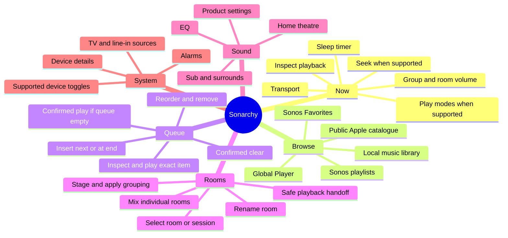

# User capability model

This page answers **what a person can accomplish with Sonarchy**. It is not the
same as [`CAPABILITIES.md`](../../CAPABILITIES.md), which declares operating
system, network, package-manager, and process privileges for marketplace and
security review.

## Product map

## Capability matrix

| Area | User outcome | Status | Important condition or boundary |
|---|---|---|---|
| Now | See title, artist, album, artwork, progress, source, and transport state | Current | State can be marked stale when refresh fails after earlier good data. |
| Now | Play, pause, stop, previous, and next | Current / capability-dependent | Previous and next depend on actions advertised by the active source. |
| Now | Seek backward, forward, or to a position | Capability-dependent | Live radio, TV, line-in, and some protected sources do not seek. |
| Now | Change whole-group volume or mute | Current | The selected room's playback group is the target. |
| Now | Change each room's volume or mute within the current group | Current | Exact room identity is preserved; group and room controls are different actions. |
| Now | Change shuffle, repeat, and crossfade | Capability-dependent | Enabled only when the Sonos queue is the active transport and the option is supported. |
| Now | Set or cancel a sleep timer | Capability-dependent | Requires a reachable selected room. |
| Browse | Browse and play Sonos Favorites | Current | Items remain provider-owned and are revalidated before playback. |
| Browse | Create, save, play, reorder, edit, and delete Sonos playlists | Current | Destructive actions require the same focused action twice within five seconds. |
| Browse | Browse/search the Sonos-indexed local music library and request re-indexing | Current | Categories, hierarchy, paging, and playability come from Sonos rather than a fixed universal list. |
| Browse | Search the public Apple Music catalogue by artist, album, and song | Current | This is public catalogue data, not the user's private Apple Music library. |
| Browse | Play a public Apple song or album through the Apple Music account already attached to Sonos | Current | Sonarchy validates a share link; the speaker performs authenticated playback. TV Autoplay can block a home-theatre album flow. |
| Browse | Search and play Global Player content through the service attached to Sonos | Current | Returned service items are re-read and matched by identity before play. |
| Queue | Read the current queue and identify the active item | Current | Results are authoritative for the selected room at the returned revision. |
| Queue | Play, move, remove, or clear exact queue items | Current | Identity and destination are checked again; destructive operations are confirmed. |
| Queue | Play now, play next, add to end, or Play if queue empty from supported browse items | Current | The confirmed empty-queue path refuses nonempty or unverifiable queues before writes. It appends/starts without clearing or rollback; a failed write can leave partial state. |
| Rooms | Select an exact room or independent playback session | Current | Selecting a session does not itself move audio. |
| Rooms | Rename an exact room | Current | The new name is confirmed with the speaker and may precede topology-cache convergence. |
| Rooms | Stage and apply group membership | Current | Staging changes nothing; one validated application request can require multiple Sonos topology calls and bounded convergence checks. |
| Rooms | Move a playback session to a safe standalone room | Capability-dependent | Moves that would silently tear apart another group are blocked. |
| Sound | Change bass, treble, loudness, balance, night mode, speech enhancement, Sub, surround, and TV settings | Capability-dependent | Controls appear only from positive or nullable backend projections; model names are not treated as proof. |
| System | List, create, edit, enable/disable, and delete alarms | Current | Alarm room and sound choices are validated against the current household. |
| System | Switch to reported TV or household line-in sources | Capability-dependent | Arbitrary URI playback is not exposed. |
| System | Inspect model, versions, battery, microphone, voice, source, and TV audio format | Capability-dependent | Unsupported or unavailable values remain null/explicit rather than inferred. |
| System | Change TV Autoplay, status light, touch controls, and an existing Trueplay profile when exposed | Capability-dependent | Sonarchy does not perform initial Trueplay tuning. |

## Explicit product boundary

Sonarchy is not a general Sonos account or installation client. Use the official
Sonos app for:

- adding or removing products;
- Wi-Fi and network setup;
- ownership transfer and account management;
- adding or removing music services;
- initial Trueplay tuning;
- bonding or separating Subs and surrounds;
- voice-assistant setup;
- TV setup, firmware, diagnostics, and Sonos support.

It is also not a Bluetooth manager, PipeWire/audio router, AirPlay sender,
generic UPnP console, web-control API, or arbitrary media-URI player.

## Cross-cutting rules

These rules apply across the capability map:

1. **Capability before control.** A control is rendered or enabled from backend
   evidence, not from a speaker model-name guess.
2. **Exact identity before mutation.** Queue, playlist, library, provider, room,
   and alarm items are revalidated before acting.
3. **Authoritative state wins.** Bounded optimistic QML values can improve
   responsiveness, but a newer backend snapshot replaces them.
4. **Destructive intent is explicit.** Queue clearing and playlist, alarm, or
   item deletion require confirmation. Play if queue empty remains confirmed
   but cannot replace a nonempty queue.
5. **Errors remain scoped.** An unrelated background success or failure cannot
   silently erase or replace the current foreground action error. Separate
   ten-second timers dismiss request/transient errors; visibility is not
   indefinite and dismissal is not proof of recovery.
6. **Secrets stay behind adapters.** QML receives normalized provider-neutral
   objects, never service credentials or raw exceptions. Local QML room
   snapshots include speaker IP addresses for display/artwork handling; the
   narrow MCP projection is a different, sanitized boundary.
7. **Keyboard parity.** Every visible action has a keyboard route.

## Current implementation mapping

The canonical positive operation inventory is in
[`sonarchy_backend/contracts.py`](../../sonarchy_backend/contracts.py). The
main user-capability groups map to protocol namespaces as follows:

| User area | Protocol families |
|---|---|
| Now | `playback.*`, `volume.*`, `mute.*` |
| Browse | `content.*`, `library.*`, `playlists.*` |
| Queue | `queue.*` |
| Rooms | `selection.*`, `topology.*`, `devices.rename`, `playback.room.move` |
| Sound | `sound.setting.set`, supported `devices.setting.set` operations |
| System | `alarms.*`, `sources.switch`, `devices.details.get` |

The mapping is directional: a protocol operation can support a user capability,
but merely registering an operation does not prove it is available for every
speaker, source, or state.

## Current and future local-AI capabilities

The [MCP contract](../mcp.md) is authoritative for tool names, permissions and
limits. QML capabilities do not imply equivalent MCP authority.

| Desired outcome | Status | Tracking |
|---|---|---|
| Inspect bounded rooms, room state and content through MCP | Current, read-only by default | [MCP setup](../mcp.md) |
| Create one exact reviewed Apple-song Sonos Playlist | Current, independent `playlist-create` opt-in; never starts playback | [Direct persistence](../ai-curated-sonos-playlists.md) |
| Append and play one exact native Sonos Playlist in an explicit room | Current, independent `playlist-play` opt-in and separate approval; standalone/stopped-or-paused/low-volume policy | [MCP setup](../mcp.md) |
| General transport, volume, queue editing and other broader AI control | Planned, not granted by either playlist permission | [#14](https://github.com/SurreptitiousFabric/omarchy-sonarchy/issues/14) |
| Reliably curate and resolve ambiguous/rejected recordings across AI workflows | Remaining orchestration/evaluation work; curation belongs to the client | [#15](https://github.com/SurreptitiousFabric/omarchy-sonarchy/issues/15), [#61](https://github.com/SurreptitiousFabric/omarchy-sonarchy/issues/61) |
| Access private Apple-library data / optionally export a native Apple playlist | Investigation / future external workflow, not current Sonarchy features | [#12](https://github.com/SurreptitiousFabric/omarchy-sonarchy/issues/12), [#72](https://github.com/SurreptitiousFabric/omarchy-sonarchy/issues/72) |
| Share one backend between QML and MCP | Current, accepted single-authority design | [ADR 0002](../adr/0002-single-authority-local-mcp.md) |

See the [AI and MCP roadmap](../ai-mcp-roadmap.md) for the remaining boundaries
and evidence gaps.
