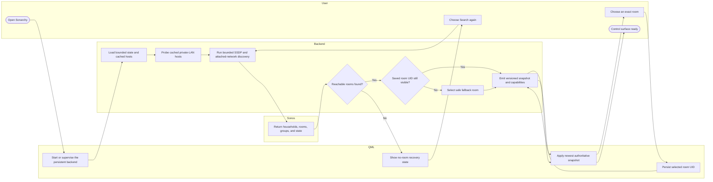
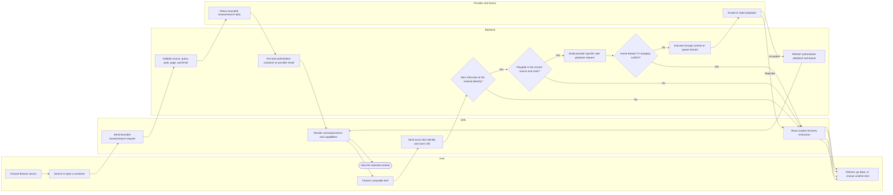
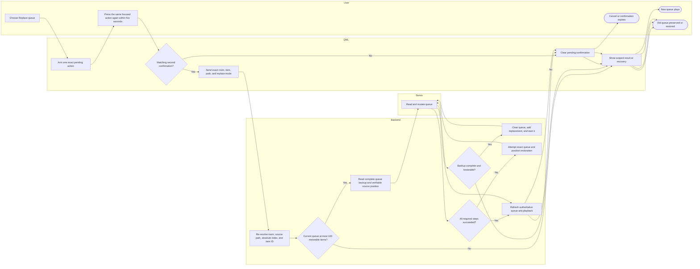
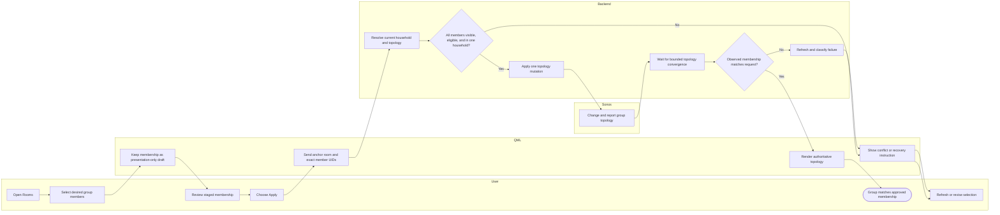
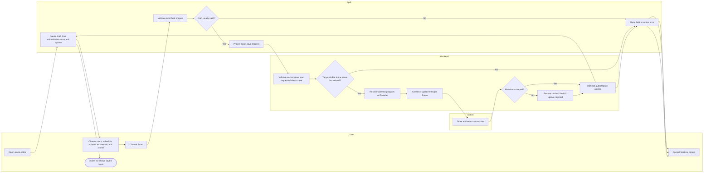
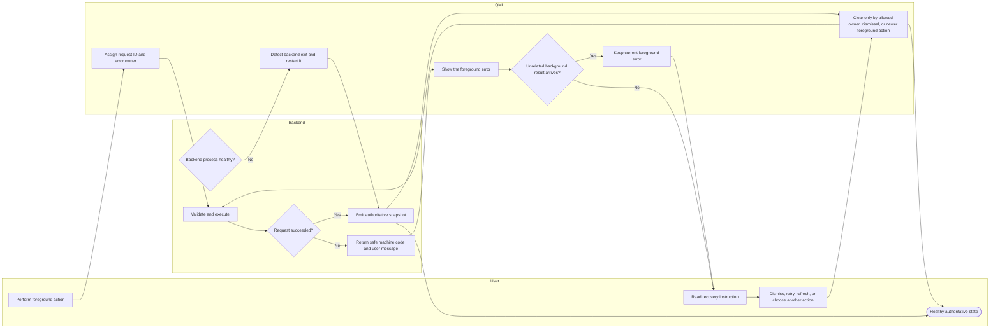
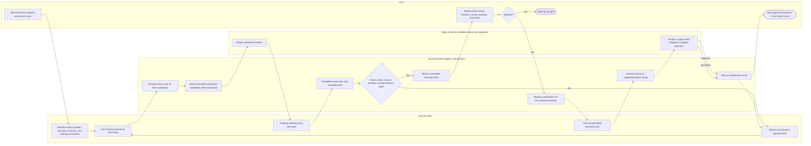

# BPMN-oriented user journeys

This page answers **how a person completes an important goal and what decisions
or recovery paths occur**. The diagrams use responsibility lanes and BPMN-like
tasks/gateways while remaining directly renderable in GitHub Markdown.

## Journey catalogue

| Journey | Status | Primary acceptance focus |
|---|---|---|
| Start, discover, and select a room | Current | Cached discovery, SSDP fallback, no-room recovery, stable selection |
| Find and play content | Current | Source capability, nested browse, exact item identity, provider failure |
| Safely replace a queue | Current | Confirmation, complete backup, stale-item check, rollback |
| Stage and apply grouping | Current | No mutation while staged, same-household validation, topology convergence |
| Create or edit an alarm | Current | Authoritative room/program options, local validation, save refresh |
| Recover from an action or backend failure | Current | Error ownership, dismiss/refresh, automatic backend restart |
| Draft and play a bespoke playlist through MCP | Planned | Permission, exact room/items, review, deterministic validation, execution |

The complete release checklist remains in
[`ACCEPTANCE_TESTS.md`](../../ACCEPTANCE_TESTS.md). These models explain the
flow; they do not replace the exact test steps.

---

## 1. Start, discover, and select a room

**Invariant:** room display names may change or collide; authoritative selection
uses a stable room identity rather than silently choosing by label.

---

## 2. Find and play content

This generic journey covers Favorites, Sonos playlists, the local library,
public Apple catalogue, and supported music services. Individual adapters can
add provider-specific validation, but they do not change the trust boundary.

**Invariant:** QML-supplied titles, artists, URLs, and positions are not treated
as authoritative provider objects. The backend resolves and validates the exact
item again.

---

## 3. Safely replace a queue

Queue replacement is not modeled as ordinary playback because it destroys the
existing queue and therefore needs stronger preconditions and recovery.

**Invariant:** a queue that cannot be backed up completely is left untouched.
A restoration attempt is reported honestly; it is not described as successful
unless the authoritative state proves it.

---

## 4. Stage and apply grouping

**Invariant:** checking boxes changes only the draft. Sonos topology changes
once, after review and Apply.

---

## 5. Create or edit an alarm

**Invariant:** the visual form does not invent room or sound options and does
not partially project an invalid draft.

---

## 6. Recover from an action or backend failure

**Invariant:** a successful background refresh cannot erase a foreground action
failure merely because it happened later. Backend restart proves recovery only
after a healthy snapshot.

---

## 7. Planned: bespoke playlist through MCP

This is a target journey, not current behavior. Its implementation is tracked by
[#10](https://github.com/SurreptitiousFabric/omarchy-sonarchy/issues/10) and
children [#11–#15](https://github.com/SurreptitiousFabric/omarchy-sonarchy/issues/11).

**Required distinctions:**

- public Apple catalogue is not described as the user's private library;
- a temporary Sonos queue is not a Sonos playlist;
- a Sonos playlist is not a native Apple Music library playlist;
- the AI proposes; Sonarchy resolves, validates, authorizes, mutates, and reports.
