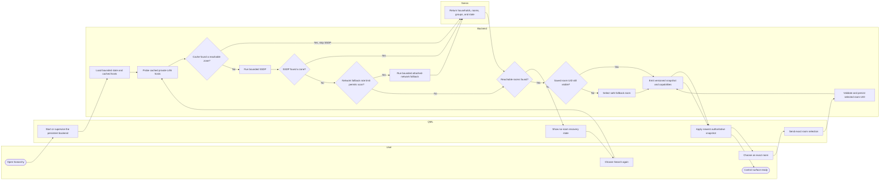
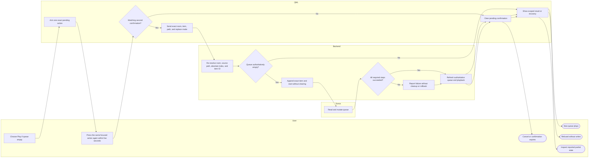
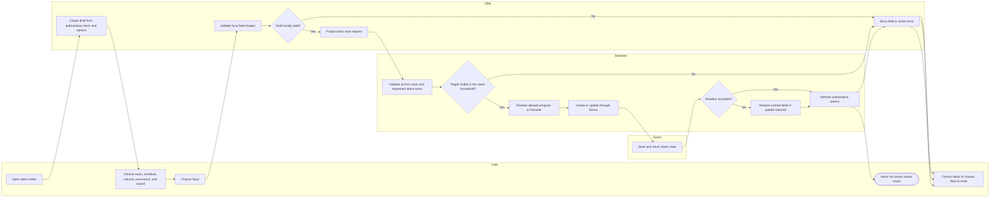
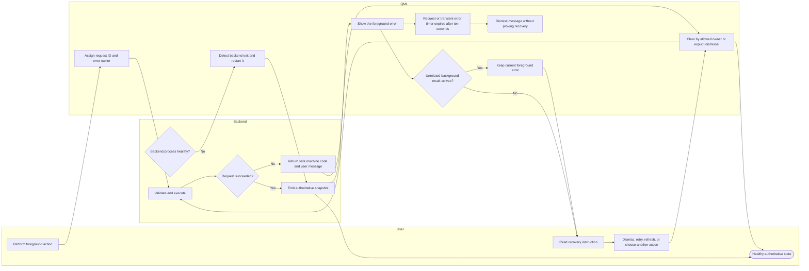
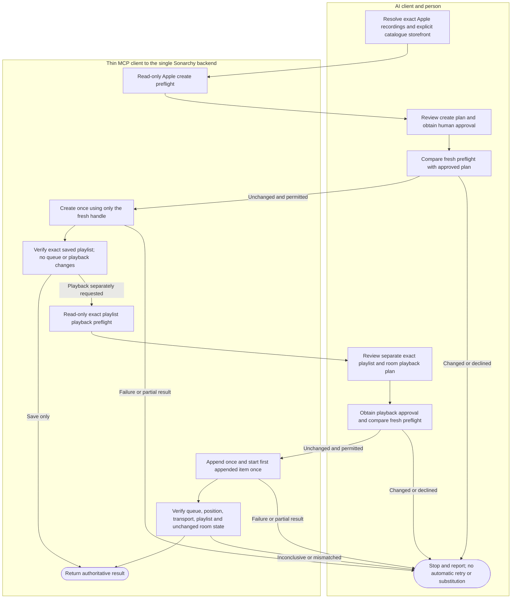

# BPMN-oriented user journeys

This page answers **how a person completes an important goal and what decisions
or recovery paths occur**. The diagrams use responsibility lanes and BPMN-like
tasks/gateways while remaining directly renderable in GitHub Markdown.

## Journey catalogue

| Journey | Status | Primary acceptance focus |
|---|---|---|
| Start, discover, and select a room | Current | Cached discovery, SSDP fallback, no-room recovery, stable selection |
| Find and play content | Current | Source capability, nested browse, exact item identity, provider failure |
| Play only if the queue is empty | Current | Confirmation, exact identity, authoritative empty guard, honest partial failure |
| Stage and apply grouping | Current | No mutation while staged, same-household validation, topology convergence |
| Create or edit an alarm | Current | Authoritative room/program options, local validation, save refresh |
| Recover from an action or backend failure | Current | Error ownership, dismiss/refresh, automatic backend restart |
| Create and separately play an exact playlist through MCP | Current narrow tools; curation is external | Independent permissions and approvals, exact room/items, fresh preflights, authoritative results |

The complete release checklist remains in
[`ACCEPTANCE_TESTS.md`](../../ACCEPTANCE_TESTS.md). These models explain the
flow; they do not replace the exact test steps.

---

## 1. Start, discover, and select a room

**Invariant:** room display names may change or collide; authoritative selection
uses a stable room identity rather than silently choosing by label.

---

## 2. Find and play content

This generic journey covers Favorites, Sonos playlists, the local library,
public Apple catalogue, and supported music services. Individual adapters can
add provider-specific validation, but they do not change the trust boundary.

**Invariant:** QML-supplied titles, artists, URLs, and positions are not treated
as authoritative provider objects. The backend resolves and validates the exact
item again. Device state is not itself a measurement of audible playback or
natural transition to the next track; physical acceptance records those
observations separately.

---

## 3. Play only if the queue is empty

The former replace mode is now exposed as **Play if queue empty**. It does not
provide general replacement or restoration of an existing provider queue.

**Invariant:** nonempty or unverifiable queues are refused before clear, add or
play calls. Even on the empty path there is no clear call. A successful append
may remain after a later failure. Use Next or End to retain an existing queue
without starting playback; general restoration remains issue #19.

---

## 4. Stage and apply grouping

**Invariant:** checking boxes changes only the draft. Review and Apply send one
application request, which may require multiple Sonos join/unjoin calls. This
is not an atomic single-device mutation or a promise of rollback.

---

## 5. Create or edit an alarm

**Invariant:** the visual form does not invent room or sound options and does
not partially project an invalid draft. New resets the editor immediately;
there is no dirty-draft detection or confirmation dialog before discarding its
unsaved edits.

---

## 6. Recover from an action or backend failure

**Invariant:** a successful background refresh cannot erase a foreground action
failure merely because it happened later. Backend restart proves recovery only
after a healthy snapshot. New foreground failures can replace the displayed
error. Request and live transient-error timers also clear their messages after
ten seconds; the ownership rule does not prevent expiry. Dismissing an error
does not fix its underlying cause.

---

## 7. Create and separately play an exact playlist through MCP

These narrow tools are implemented. The AI client owns curation, chart/source
research, recording ambiguity and the human approval interaction; Sonarchy
does not supply an AI model. Broader orchestration evaluation remains #15/#61.

Each preflight failure is read-only and must be reported before seeking a new
review. Creation and playback require independent optional permissions on top
of `read`; approving creation never approves playback. Execute only with the
second, freshly compared handle. Handles are short-lived and single-use;
`approved: true` is not proof that a person actually consented.

Create failure permits only the defined exact-ID partial-playlist cleanup.
Playback failure never clears, reconstructs or removes queue entries; an
append can remain even if start or verification fails. Device PLAYING alone
is insufficient: the exact fresh-state verification must also pass. Audible
playback and natural track transition remain separate physical observations.

A Sonos Playlist is neither a temporary queue nor a native Apple Music
playlist. Private Apple-library access and one-way Apple export remain outside
this implemented workflow. See [MCP setup](../mcp.md) for exact tools, bounds,
permissions and failure semantics.
