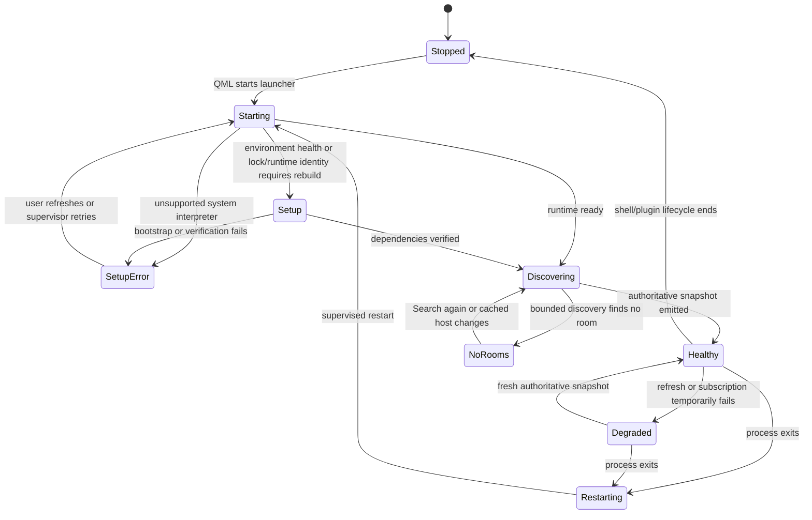
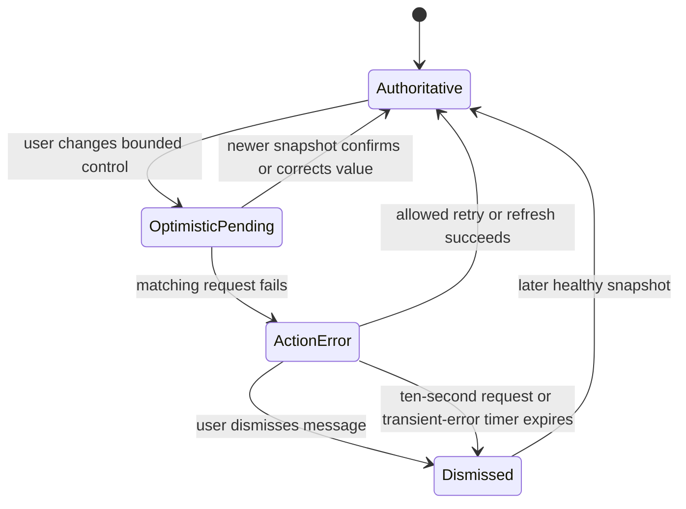
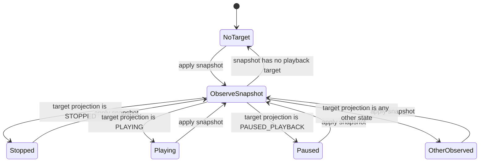
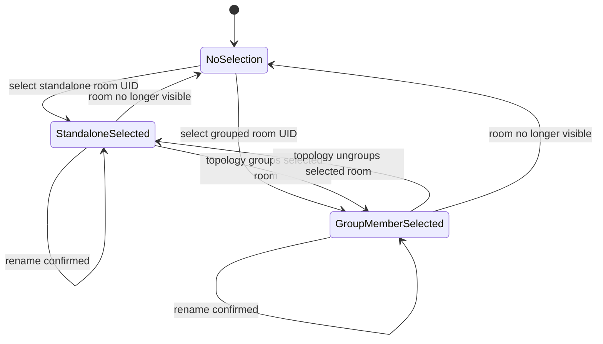
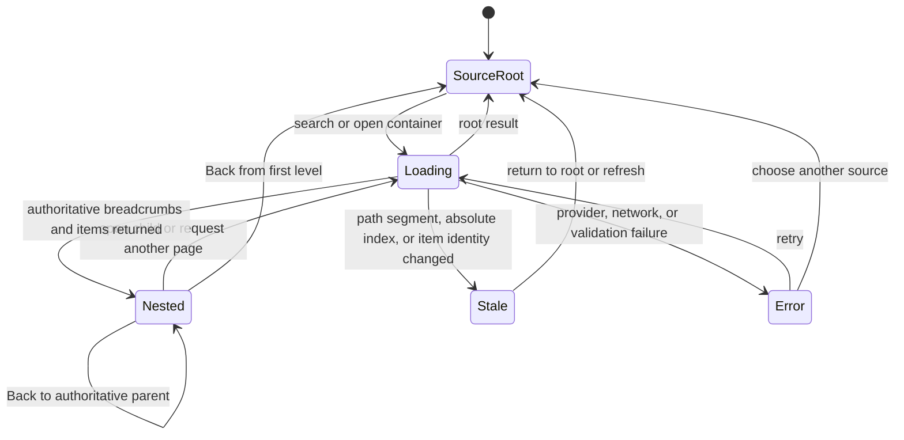
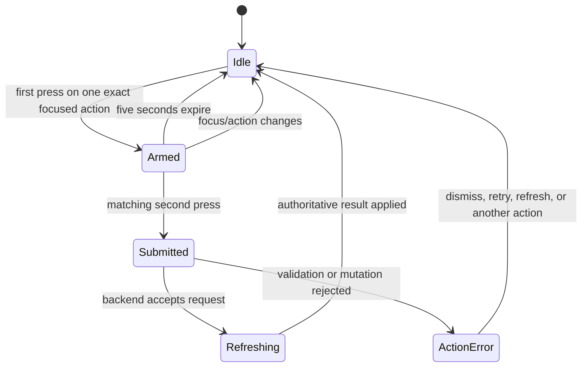
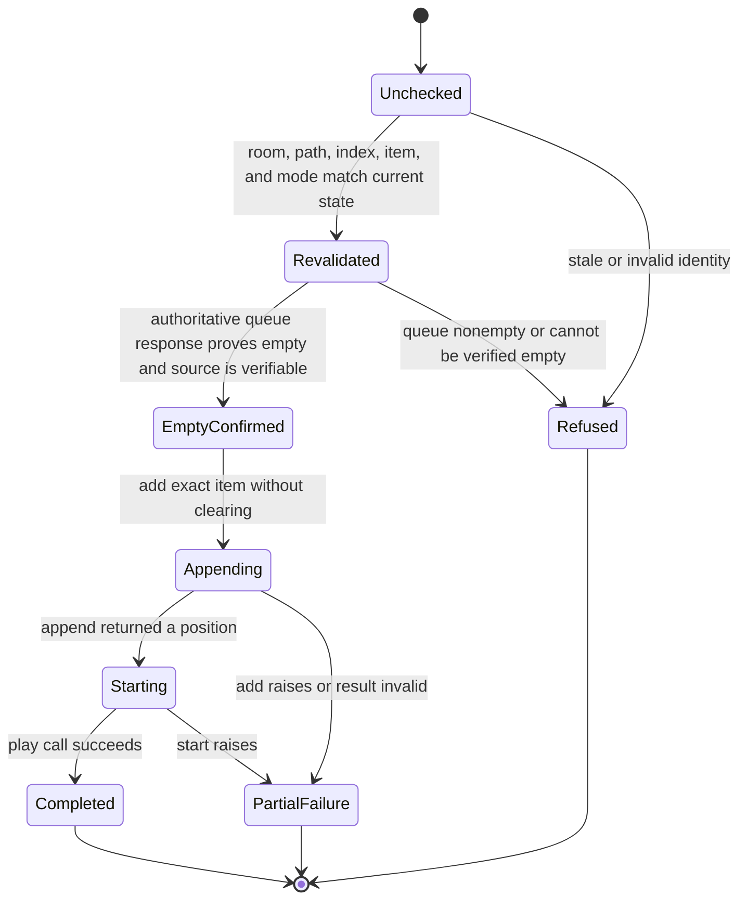
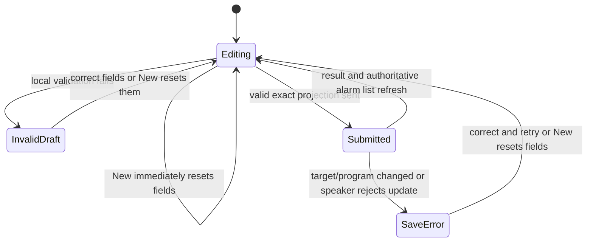

# State and capability models

This page answers **what can happen from the system's current state**. Journey
models describe a goal over time; state models describe legal transitions and
why an action may be enabled now, disabled now, or rejected after the world
changes.

## 1. Backend lifecycle

A process restart resets process-local snapshot revisions. QML treats a healthy
snapshot from the replacement process as recovery; merely starting a new PID is
not sufficient.
The launcher supports stable CPython 3.14.x only; setup/restart does not make
an unsupported interpreter compatible. See [ADR 0003](../adr/0003-python-runtime-policy.md).

## 2. Authoritative versus optimistic state

Rules:

- every request has an ID and an error owner;
- a newer authoritative snapshot wins over an older optimistic value;
- an unrelated background success cannot clear a foreground action error;
- an unrelated background failure cannot replace an error already being shown;
- timers can clear errors even without a successful owning request;
- dismissal or expiry removes the message, not the underlying problem.

## 3. Playback transport and source capability

Transport state and media source are orthogonal. A room can be `PLAYING`, for
example, while the source is Queue, Radio, TV, Line-In, or another provider.
The source determines which transitions are legal.

Every arrow here is observation, not a device command. `ObserveSnapshot` is a
logical mapping step, not an extra backend transport state or a visible loading
state. The same path applies to initial acquisition, a refreshed room selection,
and later snapshots of the current target. From any displayed state it can
project any other state, or the same state again, without a local playback action.

Selecting a different room projects that coordinator's existing state without
changing its group or transport. If the remembered room disappears, refresh can
select an available fallback; `NoTarget` applies only when the resulting snapshot
has no playback target, not to every room switch or lost remembered room.

User commands are separate inputs: play an exact supported item or resume,
pause, stop, next/previous, seek and play-mode changes require their corresponding
capabilities. A requested outcome is not an observed transition: a command may
be rejected or leave partial state, and subsequent snapshots determine what is
displayed. Another controller's actions can also change that projection.

This is a simplified projection model, not an exhaustive device transport
enum. `TRANSITIONING`, `UNKNOWN` and other nonsettled observations are not
coerced to Stopped. The backend can retain last-known playback with a stale
marker when fresh evidence is unavailable or uncertain; freshness is separate
from the displayed transport state. The diagram branches on the resulting
snapshot projection, which can be cached, not necessarily a fresh device report.

### Typical source capability matrix

This table is explanatory. The backend's positive capability projection is
authoritative for the current source.

| Action | Sonos queue | Live radio | TV | Line-In | Provider item/container |
|---|---:|---:|---:|---:|---:|
| Play/pause | Usually | Provider-dependent | Source-dependent | Source-dependent | After valid dispatch |
| Stop | Usually | Usually | Source-dependent | Source-dependent | After valid dispatch |
| Previous/next | When advertised | Usually unavailable | Unavailable | Unavailable | Depends on resulting queue/source |
| Seek | When advertised | Usually unavailable | Unavailable | Unavailable | Depends on resulting queue/source |
| Shuffle/repeat/crossfade | Queue only, when supported | Disabled | Disabled | Disabled | Enabled only after queue becomes active |
| Queue edit | Yes | Edits queue but does not necessarily replace active radio until played | Edits queue but TV Autoplay can reclaim source | Edits queue but line-in remains source until changed | Depends on exact insertion path |

No UI or MCP client should infer these rows from a speaker model name or
from stale values left over from an earlier source.

## 4. Selected room, playback group, and exact-room controls

Target rules:

- transport and group-volume actions target the selected room's current playback
  coordinator/group;
- room volume, mute, rename, and product settings target the exact room UID;
- selecting another playback session changes what is controlled but does not
  itself move audio;
- handoff is a separate validated mutation;
- room-targeted MCP calls require an explicit room UID rather than mutable QML
  selection; public Apple browsing alone can omit the room. Supplying an
  invalid room is still an error, not permission to fall back silently.

## 5. Content navigation

A displayed list is not an authority grant. Hierarchical library mutations
re-read bounded path segments, the claimed absolute index and the exact item
identifier so an updated Sonos index cannot redirect an old click to a new item.
Other sources follow their own lookup/validation contracts. In particular,
Favorite activation uses a cached ID and does not re-read the Favorites
inventory; the library guarantee must not be applied to that cached path.

## 6. Destructive-action confirmation

The confirmation identity includes the action and target. A first press on one
queue item cannot confirm deletion of another item, and a drag/drop or keyboard
move cannot inherit an unrelated pending destructive action.

## 7. Guarded empty-queue playback

This is the confirmed **Play if queue empty** action, not general replacement.
Refusal happens before writes. Partial failure is reported without clearing,
removing, reconstructing or replaying queue entries. Issue #19 remains open;
no arbitrary-provider restoration guarantee is made.

## 8. Alarm draft

The draft owns presentation edits. The backend owns household membership,
program identity, and the mutation. A rejected update restores locally cached
alarm fields before authoritative refresh. These labels describe the flow,
not a dirty-state flag in QML: there is no dirty-draft tracking or confirmed
cancel. The editor's New action calls `resetAlarm()` immediately, discarding
unsaved edits without a dialog; saving refreshes the list, not an implicit
reset of all editor fields.

## 9. Current MCP permissions

Permissions are independent configuration grants, not a hierarchy of transport,
queue and playlist authority. Changes take effect when the backend restarts.

| Configuration | Authority |
|---|---|
| `enabled = false` | MCP disabled |
| `permissions = ["read"]` | Default bounded reads and read-only preflights |
| `read` plus `playlist-create` | Reads and exact reviewed Apple Sonos Playlist creation; no playback |
| `read` plus `playlist-play` | Reads and exact reviewed native Sonos Playlist playback; no creation |
| `read` plus both optional grants | Both narrow writes, each with its own approval and preflight |

Speaker settings, topology, alarms, source switching, room rename, general
transport/volume/queue editing and generic protocol passthrough are absent.
Neither a QML capability nor one playlist grant authorizes another MCP action.
See [MCP setup](../mcp.md) for private configuration validation and exact bounds.

## 10. Current exact-plan lifecycle

```mermaid
stateDiagram-v2
    [*] --> Requested
    Requested --> Drafted: client resolves exact items and target
    Drafted --> Validating: read-only preflight
    Validating --> NeedsReview: invalid or unresolved plan
    NeedsReview --> Drafted: person reviews a revised proposal
    Validating --> ReviewReady: deterministic validation succeeds
    ReviewReady --> Cancelled: user declines
    ReviewReady --> Approved: user approves exact plan and action
    Approved --> Revalidating: repeat read-only preflight
    Revalidating --> NeedsReview: material facts changed
    Revalidating --> Executing: identical plan and independent permission; use fresh handle once
    ReviewReady --> Invalidated: expiry or backend restart
    Approved --> Invalidated: expiry or backend restart
    Executing --> Completed: complete authoritative verification succeeds
    Executing --> Failed: conflict, write failure or inconclusive verification
    Cancelled --> [*]
    Completed --> [*]
    Failed --> [*]
    Invalidated --> [*]
```

This lifecycle applies separately to creation and playback. The AI client owns
interpretation, proposal and human consent; Sonarchy validates the exact plan,
enforces permissions and single-use tickets, executes, and reports verified or
partial results. `approved: true` cannot establish that the client actually
obtained consent. Failure never implies an automatic execution retry. Creating
a playlist ends that plan; playing it needs a new, separately approved plan.
