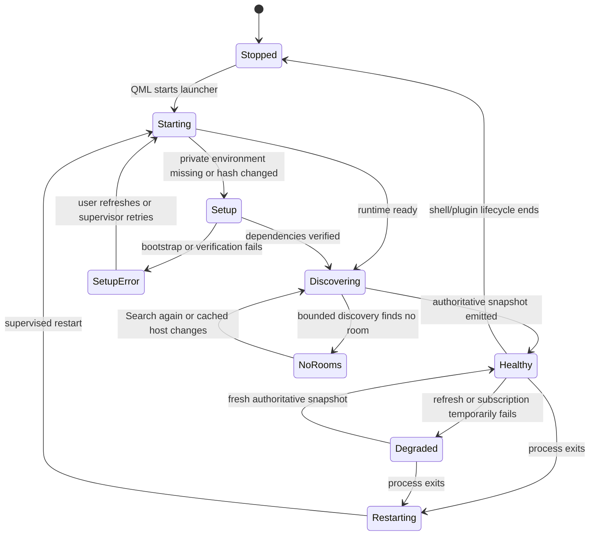
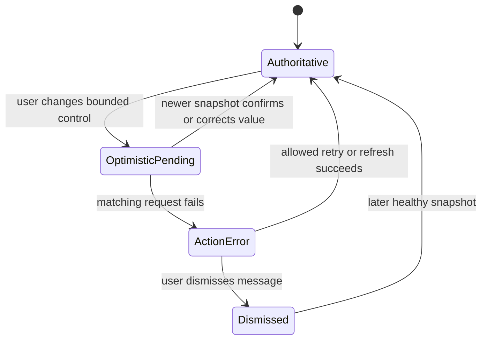
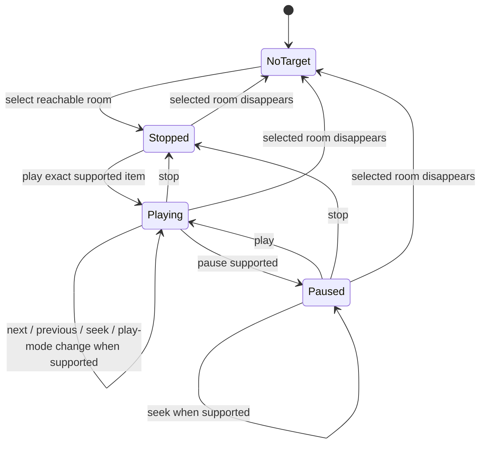
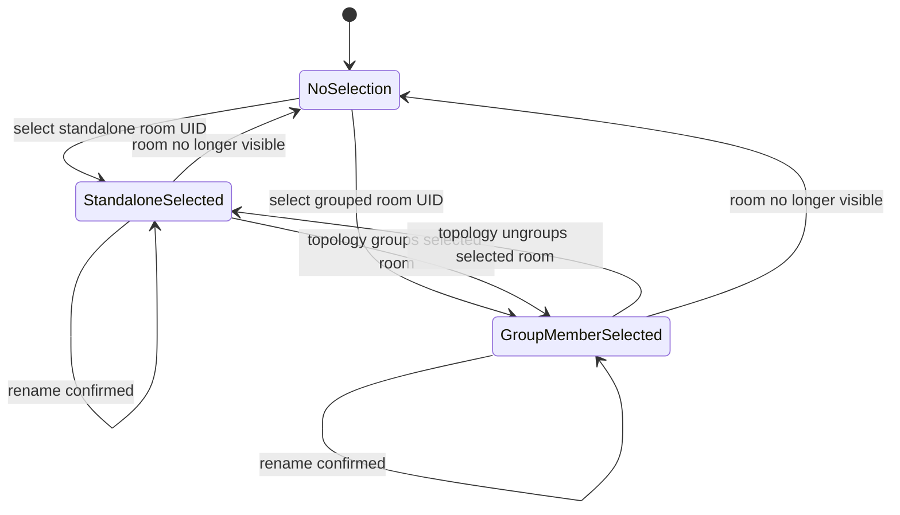
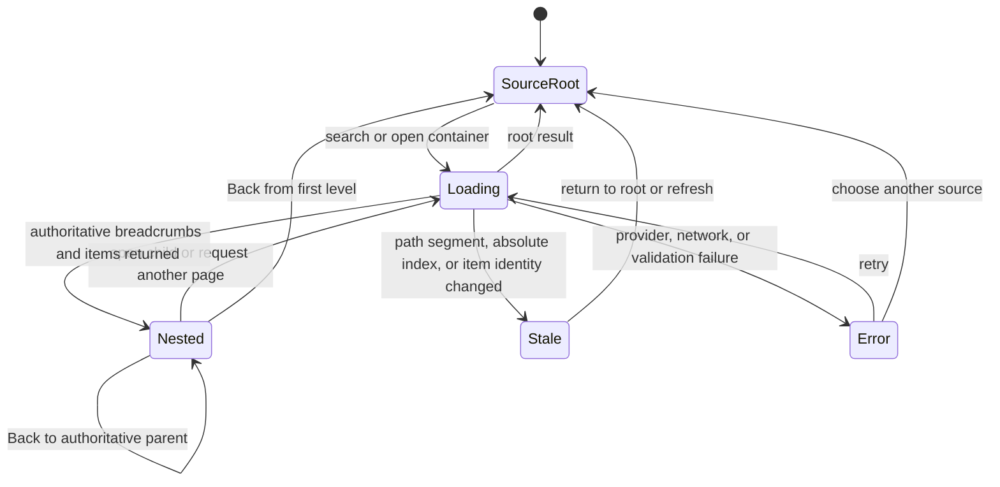
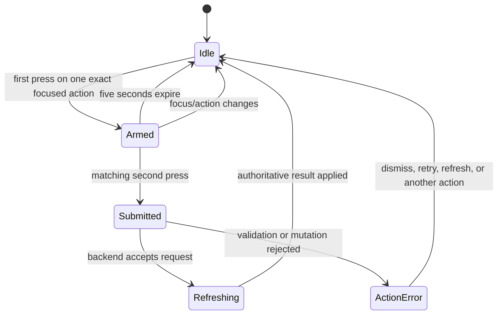
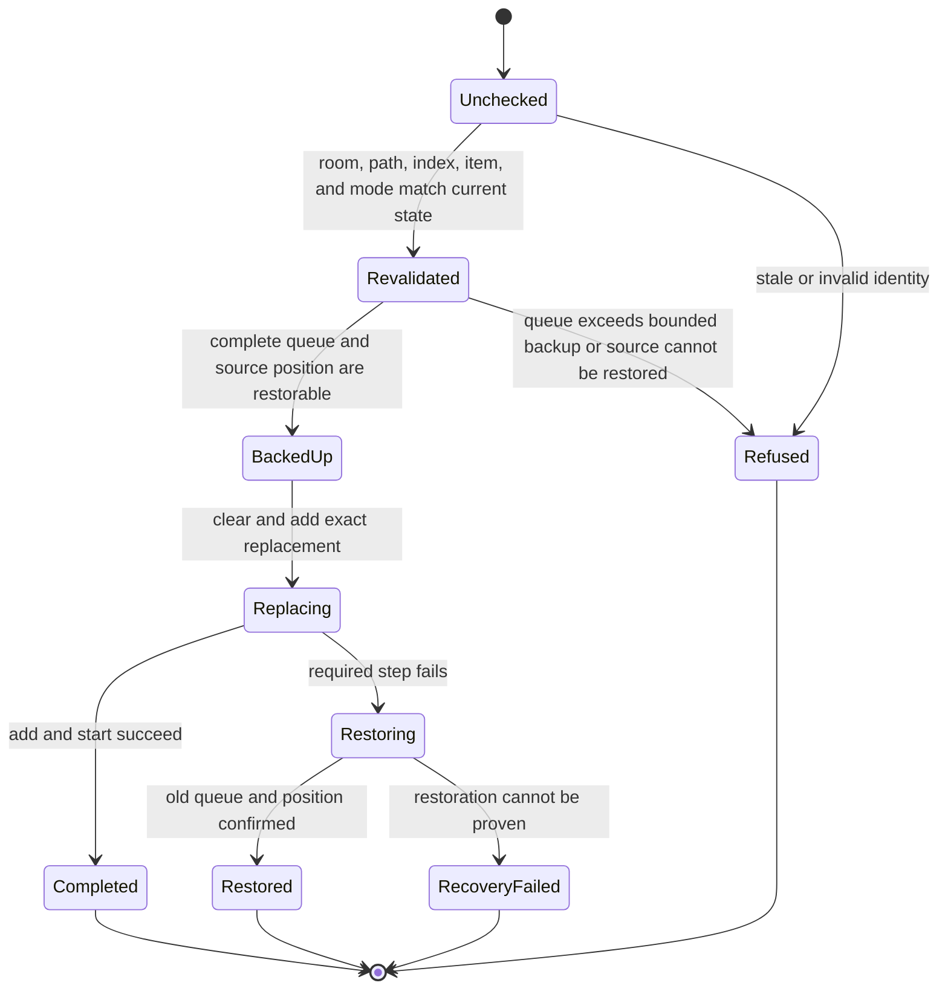
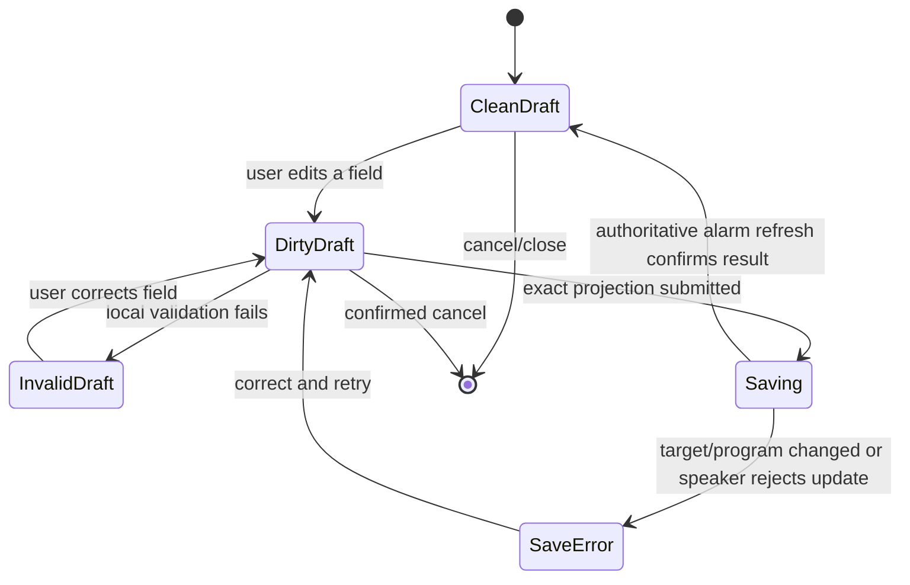
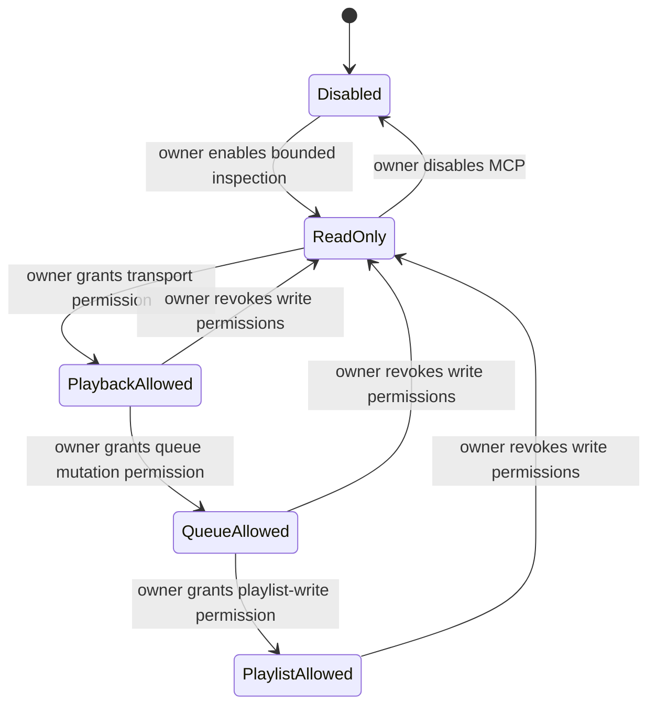
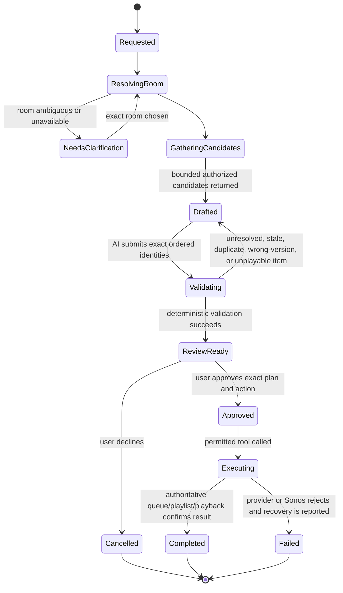

# State and capability models

This page answers **what can happen from the system's current state**. Journey
models describe a goal over time; state models describe legal transitions and
why an action may be enabled now, disabled now, or rejected after the world
changes.

## 1. Backend lifecycle

A process restart resets process-local snapshot revisions. QML treats a healthy
snapshot from the replacement process as recovery; merely starting a new PID is
not sufficient.

## 2. Authoritative versus optimistic state

Rules:

- every request has an ID and an error owner;
- a newer authoritative snapshot wins over an older optimistic value;
- an unrelated background success cannot clear a foreground action error;
- an unrelated background failure cannot replace an error already being shown;
- dismissal removes the message, not the underlying network or setup problem.

## 3. Playback transport and source capability

Transport state and media source are orthogonal. A room can be `PLAYING`, for
example, while the source is Queue, Radio, TV, Line-In, or another provider.
The source determines which transitions are legal.

### Typical source capability matrix

This table is explanatory. The backend's positive capability projection is
authoritative for the current source.

| Action | Sonos queue | Live radio | TV | Line-In | Provider item/container |
|---|---:|---:|---:|---:|---:|
| Play/pause | Usually | Provider-dependent | Source-dependent | Source-dependent | After valid dispatch |
| Stop | Usually | Usually | Source-dependent | Source-dependent | After valid dispatch |
| Previous/next | When advertised | Usually unavailable | Unavailable | Unavailable | Depends on resulting queue/source |
| Seek | When advertised | Usually unavailable | Unavailable | Unavailable | Depends on resulting queue/source |
| Shuffle/repeat/crossfade | Queue only, when supported | Disabled | Disabled | Disabled | Enabled only after queue becomes active |
| Queue edit | Yes | Edits queue but does not necessarily replace active radio until played | Edits queue but TV Autoplay can reclaim source | Edits queue but line-in remains source until changed | Depends on exact insertion path |

No UI or future MCP client should infer these rows from a speaker model name or
from stale values left over from an earlier source.

## 4. Selected room, playback group, and exact-room controls

Target rules:

- transport and group-volume actions target the selected room's current playback
  coordinator/group;
- room volume, mute, rename, and product settings target the exact room UID;
- selecting another playback session changes what is controlled but does not
  itself move audio;
- handoff is a separate validated mutation;
- a future AI call must carry an explicit room identity rather than relying only
  on mutable QML selection.

## 5. Content navigation

A displayed list is not an authority grant. Before a mutation, the backend
re-reads bounded path segments, the claimed absolute index, and the exact item
identifier so an updated Sonos index cannot redirect an old click to a new item.

## 6. Destructive-action confirmation

The confirmation identity includes the action and target. A first press on one
queue item cannot confirm deletion of another item, and a drag/drop or keyboard
move cannot inherit an unrelated pending destructive action.

## 7. Queue replacement transaction

`RecoveryFailed` must be visible and actionable. It must never be collapsed into
a generic success message.

## 8. Alarm draft

The draft owns presentation edits. The backend owns household membership,
program identity, and the mutation. A rejected update restores locally cached
alarm fields before authoritative refresh.

## 9. Planned MCP permission states

This model is a design constraint for issues #11–#15, not current behavior.

Speaker settings, topology, alarms, source switching, room rename, arbitrary
volume, and generic protocol passthrough remain outside these initial states.
They require separate design and grants rather than being implicitly included in
“control Sonos.”

## 10. Planned bespoke-playlist plan

The AI client owns interpretation and proposal. Sonarchy owns exact resolution,
validation, permission, confirmation, mutation, and authoritative reporting.
